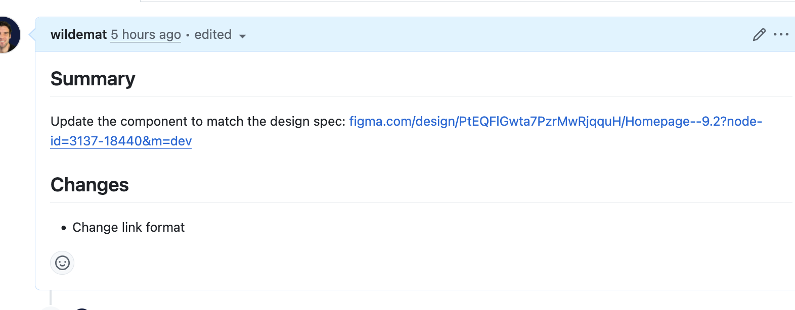
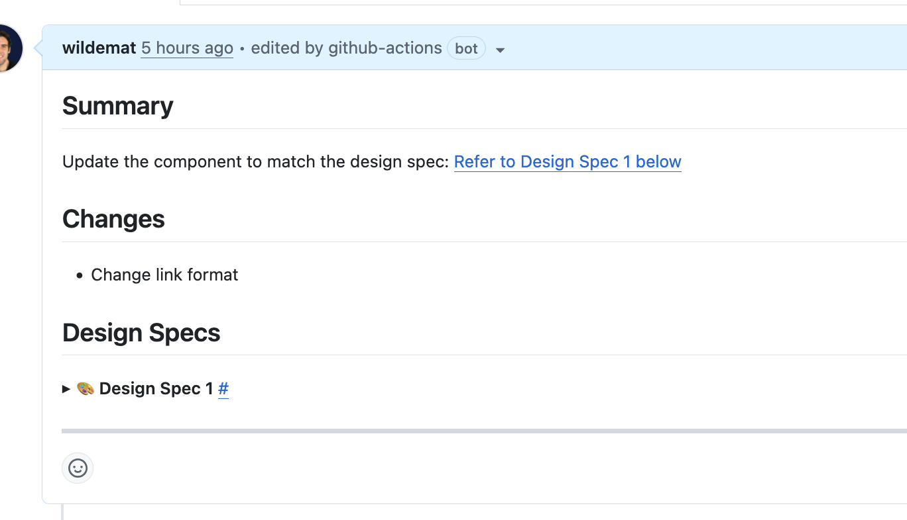
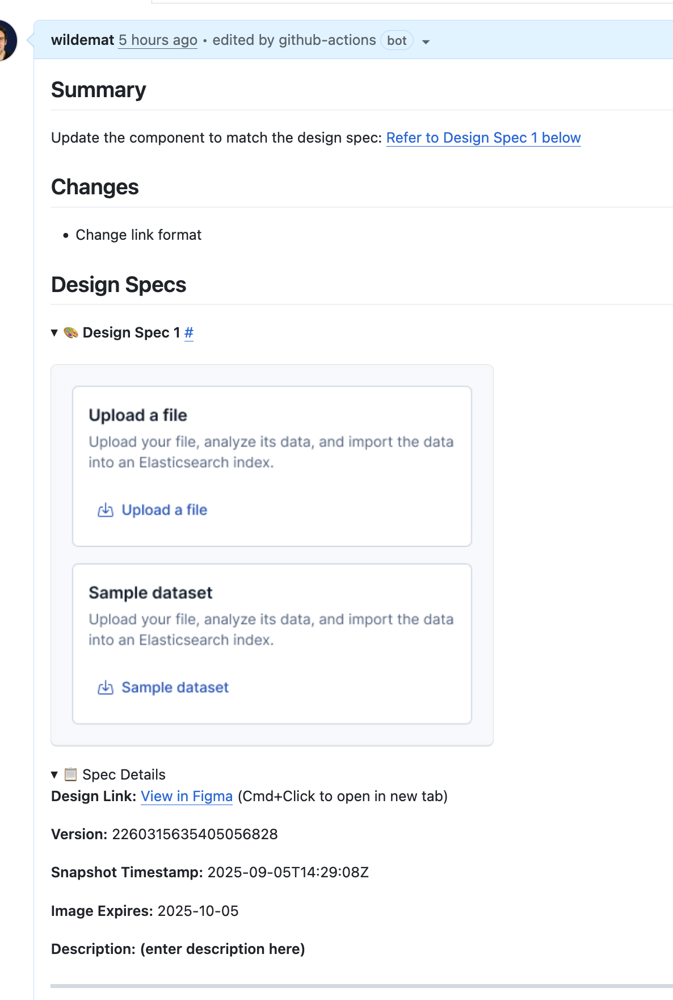

[](https://claude.ai/)
[](https://github.com/wildemat/github-figma-action/actions/workflows/test.yml)
[](https://github.com/wildemat/github-figma-action/actions/workflows/test.yml)

# Figma PR Images - Github Action

> [!WARNING]
> **Figma Token Required**: This GitHub Action requires a Figma API token to be stored as a repository secret. If you can't properly scope a Figma token for all repository owners/collaborators, consider using the [personal browser extension](https://github.com/wildemat/figma-pr-browser-extension) instead, which runs locally without sharing tokens.

Figma links and screenshots in PRs can become outdated as designs change while a PR is open.

With this Github Action, copy and paste any number of figma node links into your PR and receive a nice, versioned outline of relevant design specs.

## Before and after

| Before                       | After                      |
| ---------------------------- | -------------------------- |
|  |  |

**Details:**



## Features

- **Smart Link Processing**: Scans PR descriptions for Figma URLs (above and within the Design Specs section)
- **Version Tracking**: Fetches version info and timestamps from Figma API automatically
- **Clean Organization**: Replaces original Figma URLs with numbered references to organized Design Specs section
- **Preview Images**: Embeds preview images with 30-day expiration from Figma's temporary URLs
- **Collapsible Design**: Organizes all design specs in visually separated, collapsible sections
- **Duplicate Prevention**: Maintains proper numbering and prevents duplicate entries
- **Flexible Headers**: Supports any heading level (# through ######) for "Design Specs" sections
- **Template Friendly**: Safe for GitHub issue templates - respects section boundaries
- **Manual Editing**: Includes blank description fields for custom annotations

## Installation

### Option 1: Repository Installation

1. In your repository, create `.github/workflows/figma-pr-images.yml`:

```yaml
name: Figma PR Images

on:
  pull_request:
    types: [opened, edited]

jobs:
  figma-pr-images:
    uses: wildemat/github-figma-action/.github/workflows/figma-pr-images.yml@main
    secrets:
      FIGMA_TOKEN: ${{ secrets.FIGMA_TOKEN }}
```

### Option 2: Copy Files

1. Copy the `.github` folder and `package.json` to your repository
2. Add `FIGMA_TOKEN` to your repository secrets

### Option 3: Git Subtree

```bash
git subtree add --prefix=.figma-action https://github.com/wildemat/github-figma-action.git main --squash
```

Then create `.github/workflows/figma-pr-images.yml`:

```yaml
name: Figma PR Images

on:
  pull_request:
    types: [opened, edited]

jobs:
  figma-pr-images:
    runs-on: ubuntu-latest
    permissions:
      contents: read
      pull-requests: write

    steps:
      - uses: actions/checkout@v4
      - uses: actions/setup-node@v4
        with:
          node-version: "21"
      - run: cd .figma-action && npm install
      - env:
          FIGMA_TOKEN: ${{ secrets.FIGMA_TOKEN }}
          GITHUB_TOKEN: ${{ secrets.GITHUB_TOKEN }}
          PR_NUMBER: ${{ github.event.pull_request.number }}
          PR_BODY: ${{ github.event.pull_request.body }}
        run: node .figma-action/.github/scripts/figma-pr-images.js
```

## Run Conditions

This GitHub Action can be configured to run in different ways:

### Default Behavior (Repository Installation)

- Runs automatically on PR events: `opened`, `edited`
- Processes all PRs regardless of labels

### Label-Based Triggering

To run only on PRs with a specific label, the workflow supports:

- **Label requirement**: Add the condition `if: contains(github.event.pull_request.labels.*.name, 'ci:figma-links')` to your workflow
- **Trigger events**: Include `labeled` in the PR trigger types to run when the label is added
- **Use case**: Ideal for repositories where you want selective Figma processing

Example workflow configuration for label-based triggering:

```yaml
on:
  pull_request:
    types: [opened, synchronize, labeled]
  pull_request_target:
    types: [labeled]

jobs:
  figma-pr-images:
    if: contains(github.event.pull_request.labels.*.name, 'ci:figma-links')
    # ... rest of job configuration
```

### Workflow Call Integration

The action also supports being called from other workflows using `workflow_call`, allowing for complex automation pipelines.

## Setup

### 1. Get Figma API Token

Visit **https://www.figma.com/settings** and follow these steps:

1. Go to **Account** tab (if not already selected)
2. Scroll down to **"Personal access tokens"** section
3. Click **"Create new token"**
4. Give it a descriptive name (e.g., "GitHub Action")
5. Copy the generated token immediately (you won't be able to see it again)

⚠️ **Important**: Save the token right away - Figma only shows it once for security reasons.

### 2. Add GitHub Secret

In your repository, go to **Settings → Secrets and variables → Actions** and add:

- **Name**: `FIGMA_TOKEN`
- **Value**: The token you copied from Figma

### 3. Test the Setup

Create a PR with a Figma URL in the description to verify the action works correctly.

## How It Works

### 1. Adding Figma Links

Paste Figma design URLs anywhere in your PR description. The script processes:

- Links **above** the Design Specs section
- Links **within** the Design Specs section (in unprotected areas)
- Links **below** the Design Specs section are ignored

### 2. Supported URL Formats

```
https://www.figma.com/design/FILE_ID/FILE_NAME?node-id=NODE_ID
```

Examples:

- Standalone URL: `https://www.figma.com/design/PtEQFlGwta7PzrMwRjqquH/Homepage--9.2?node-id=3143-20344`
- Markdown link: `[New homepage design](https://www.figma.com/design/PtEQFlGwta7PzrMwRjqquH/Homepage--9.2?node-id=3143-20344)`

### 3. Processing Behavior

**Before processing:**

```markdown
Here's the new design: https://www.figma.com/design/PtEQFlGwta7PzrMwRjqquH/Homepage--9.2?node-id=3143-20344

And [another view](https://www.figma.com/design/PtEQFlGwta7PzrMwRjqquH/Homepage--9.2?node-id=3185-7339)
```

**After processing:**

```markdown
Here's the new design: [Refer to Design Spec 1 below](#design-spec-1)

And another view ([Refer to Design Spec 2 below](#design-spec-2))

## Design Specs

<!-- START_SPEC_1 -->

<a id="design-spec-1"></a>

### Design Spec 1 [#](#design-spec-1)

<kbd></kbd>

<details>
<summary>spec details</summary>

**Design Link:** [View in Figma](https://www.figma.com/design/PtEQFlGwta7PzrMwRjqquH/?node-id=3143-20344&version-id=2260315635405056828&m=dev) (Cmd+Click to open in new tab)

**Version:** 2260315635405056828

**Snapshot Timestamp:** 2025-09-05T14:29:08Z

**Image Expires:** 2025-10-05

**Description:**

</details>
<!-- END_SPEC_1 -->

<!-- START_SPEC_2 -->

<a id="design-spec-2"></a>

### Design Spec 2 [#](#design-spec-2)

<!-- ... similar structure ... -->

<!-- END_SPEC_2 -->

<!-- END_DESIGN_SPECS -->
```

## Design Specs Section Requirements

### Section Heading Format

The script looks for "Design Specs" headings in any of these formats (case-insensitive):

```markdown
# Design Specs

## Design Specs

### design specs

#### DESIGN SPECS

##### Design specs

###### design Specs
```

⚠️ **Important**: Only **one** Design Specs section is allowed. If multiple sections are detected, the script will error and ask you to consolidate them.

### Hidden End Marker

The script automatically adds a hidden HTML comment to mark the end of the Design Specs section:

```html
<!-- END_DESIGN_SPECS - WILL NOT DETECT FIGMA LINKS BELOW THIS LINE -->
```

⚠️ **Important**: If you manually move or edit the Design Specs section, ensure you also move this end marker. The script uses this marker to:

- Determine where to append new design specs
- Count existing design specs for proper numbering
- Avoid processing Figma links that appear below this marker

### Protected Content Areas

Each design spec is surrounded by protected markers:

```html
<!-- START_SPEC_1 -->
<!-- ... spec content ... -->
<!-- END_SPEC_1 -->
```

Content within these markers is never modified by the script, ensuring your generated specs remain intact.

### Link Processing Rules

1. **Processes links above and within Design Specs section** - Links below the section end marker are ignored
2. **All links become references** - Both above and within section links are replaced with reference text pointing to generated specs
3. **Maintains existing numbering** - New specs continue from the highest existing number
4. **Handles both formats**:
   - Standalone URLs → `[Refer to Design Spec X below](#design-spec-x)`
   - Markdown links `[text](url)` → `text ([Refer to Design Spec X below](#design-spec-x))`
5. **Creates section if missing** - If no Design Specs section exists, creates one at the end
6. **Uses existing version if specified** - If URL contains `version-id` parameter, uses that instead of fetching latest
7. **Includes description field** - Each spec includes a blank **Description:** field for manual editing

### Safe for Issue Templates

You can safely include `## Design Specs` in your GitHub issue templates. The action:

- **Respects section boundaries** - Only processes content within the Design Specs section
- **Stops at next heading** - Processing ends when it encounters the next section heading of the same level (e.g., another `##` heading)
- **Won't interfere** - Other template sections like "## Steps to Reproduce" or "## Expected Behavior" remain untouched

### Image Expiration

- Figma API image URLs expire after **30 days**
- The expiration date is displayed in each design spec
- After expiration, images will show as broken links but the Figma design links remain functional

## Testing

This project uses Jest for testing with comprehensive coverage of the core functionality.

### Running Tests Locally

```bash
# Install dependencies
yarn install

# Run all tests
yarn test

# Run tests with coverage report
yarn test:coverage

# Generate JSON coverage summary
yarn test:coverage-json
```

### Continuous Integration

Tests run automatically on every push and pull request via GitHub Actions. The workflow:

- Runs tests on Node.js 21 using Yarn for dependency management
- Generates comprehensive coverage reports with Jest
- Updates the coverage badge on the main branch automatically
- Displays coverage summaries in GitHub Actions job summaries
- Posts detailed coverage comments on pull requests
- Enforces minimum 5% coverage thresholds (current baseline)

### Coverage Reporting

**Multiple ways to view coverage:**

1. **README Badge**: Live coverage percentage updated automatically
2. **GitHub Actions Summary**: Detailed coverage data in workflow run summaries
3. **Pull Request Comments**: Automatic coverage table with file-by-file breakdown
4. **Local Development**: Run `yarn test:coverage` for detailed terminal output

**Current Test Coverage:**

- Figma URL parsing and validation
- API response mocking for offline testing
- Design spec snippet generation with collapsible details
- Reference text creation for both standalone and markdown links
- Link object creation and manipulation
- Date calculations and URL formatting
- Clean Figma URL generation

The test suite uses Jest with comprehensive mocking of Figma API calls, ensuring tests run reliably without external dependencies. Coverage thresholds are set to current baseline levels and will be increased as test coverage improves.
